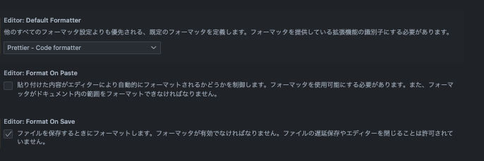

# WEBCREATOR KO

[Next.js](https://nextjs.org/) を使用したプロジェクトです<br />
ディレクトリ構造やファイル名などは React/Next.js の仕様に準じます

## 開発サーバーを起動

```bash
npm run dev
# or
yarn dev
```

## 使用している node のバージョン

v20.16.0 (2024/8)

## エディタ(VSCode)上で Prettier の設定周りの確認方法

1. Prettier のエクステンションをインストール)<br />
   https://marketplace.visualstudio.com/items?itemName=esbenp.prettier-vscode

2. VSCodeの設定を確認<br />
   ・Default Formatter が Prettier になってること<br />
   ・Format on Save にチェックが入っていること
   

## CMS
使用している CMS は WordPress で、Headless にして連携を行なってます
